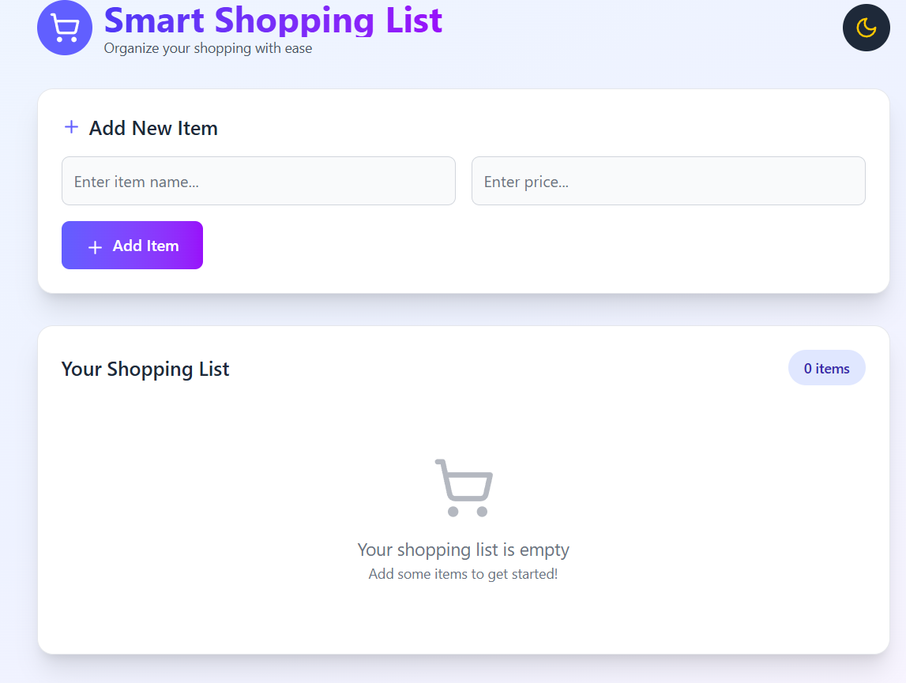
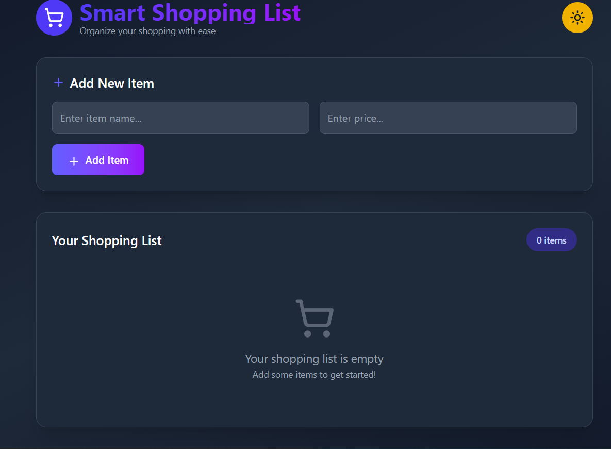
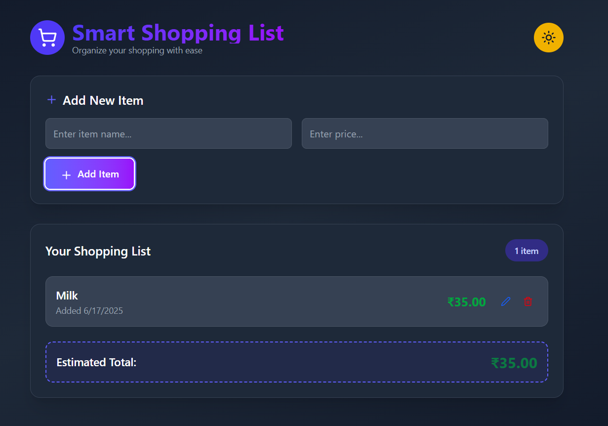

# Smart Shopping List 

A modern, responsive shopping list application with dark mode support, built with React and Tailwind CSS.

## Features ✨

• 🛒 Add, edit, and delete shopping items

• 💰 Track item prices and calculate total cost

• 🌙 Dark/light mode toggle

• 📱 Responsive design for all screen sizes

• ✨ Smooth animations and transitions

• ✅ Form validation

• 📅 Item creation timestamps


## Technologies Used 🛠️

• React

• Tailwind CSS

• Lucide React (for icons)


## Installation & Setup 🚀

1. **Clone the repository:**
   ```bash
   git clone https://github.com/your-username/react-shopping-list.git

2. **Install Dependencies:**
   ```bash
      npm install
      #and
      npm install lucide-react

3. **Tailwind CSS Setup:**

   This project uses Tailwind CSS for styling.

   If Tailwind is not yet installed, refer to the official Tailwind installation guide here:
   👉 https://tailwindcss.com/docs/installation

4. **Start the devwlopement server:**
    ```bash
    npm run dev

## Usage/Screenshots 📸





## Acknowledgements 🌟

• [React](https://react.dev/)

• [Tailwind CSS](https://tailwindcss.com/)

• [Lucide Icons](https://lucide.dev/)
